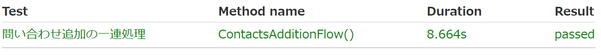

## 単体テスト
### 1. HelloWorld出力 コントローラーでのmessageの受け渡し  

### 2. 問い合わせ画面へのルート遷移  
### 3. 問い合わせ一覧画面へのルート遷移 
### 4. 問い合わせ内容確認へのルート遷移   
### 5. confirm画面での送信ボタンの押下 DBへの保存処理  

### 6. DBからの読み取り  

## 結合テスト
### 7. webClientによる問い合わせ完了に至る一連の動き 結合テスト  

